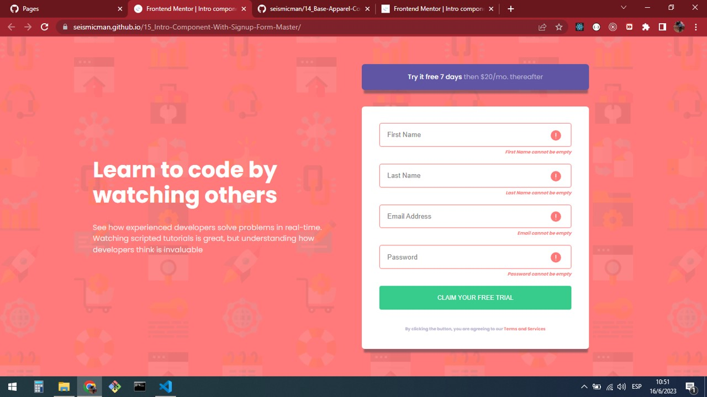
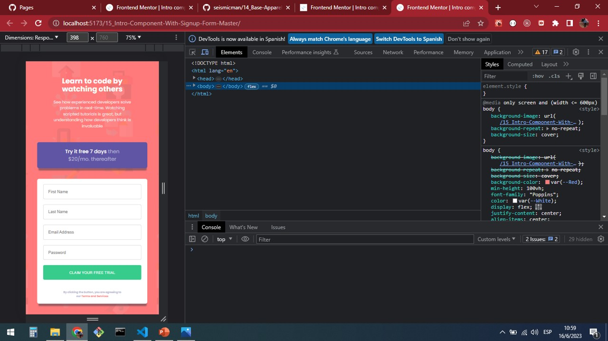

# Frontend Mentor - Intro component with sign up form solution

This is a solution to the [Intro component with sign up form challenge on Frontend Mentor](https://www.frontendmentor.io/challenges/intro-component-with-signup-form-5cf91bd49edda32581d28fd1). Frontend Mentor challenges help you improve your coding skills by building realistic projects.

## Table of contents

- [Overview](#overview)
  - [Screenshot](#screenshot)
  - [Links](#links)
- [My process](#my-process)
  - [Built with](#built-with)
  - [What I learned](#what-i-learned)
  - [Continued development](#continued-development)
  - [Useful resources](#useful-resources)
- [Author](#author)

## Overview

### Screenshots

### Links

Solution URL: [https://seismicman.github.io/15_Intro-Component-With-Signup-Form-Master/](https://seismicman.github.io/15_Intro-Component-With-Signup-Form-Master/)

## My process

### Built with

- Semantic HTML5 markup
- CSS custom properties
- Flexbox
- [React](https://reactjs.org/) - JS library

### What I learned

This a project that we can mainly develop in HTML and CSS. However, I developed it in React using components and CSS for the styles. It was so useful to understand the HTML elements as section, articles, input text and buttons. Also, in this project I used regular expressions to validate a string for email.

Also, it was very useful to understand Flexbox to organize the different components of the User Interface and the use of media queries to switch between desktop and mobile versions.

Regarding the functionality of this challenge in react, I used a component "Card" and three usestate to manage "form" "form_errors" and "valid" to control when we get a valid form. With the value of these parameters, I used conditional rendering to control each elements and the error messages. Also, several arrow functions were used to control the form when an element changed vaidations were done or the form was submitted.

### Continued development

I would like to continue developing this challenges using React as main resource and complementing with other ones as HTML5, CSS, SAAS, Bootstrap, Tailwind among others.

### Useful resources

- [https://www.youtube.com/@FaztCode <- To learn about tech for developers](https://www.youtube.com/@FaztCode) - Fun youtube channel where you will find a wide variety of topics about technology for developers. It was very useful for me to deploy my projects on github and github pages.
- [https://jonmircha.com/cursos <- To learn about frontend resources](https://jonmircha.com/cursos) - This is an amazing spanish channel when do you can learn about HTML5, CSS, React, Git and Github, among others. I'd recommend it to anyone still learning about these resources.

## Author

- Frontend Mentor - [@seismicman](https://www.frontendmentor.io/profile/seismicman)
